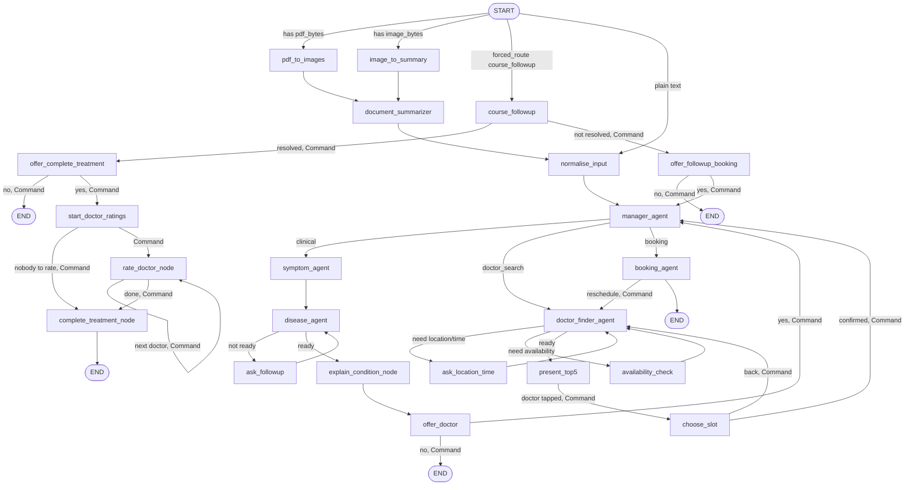
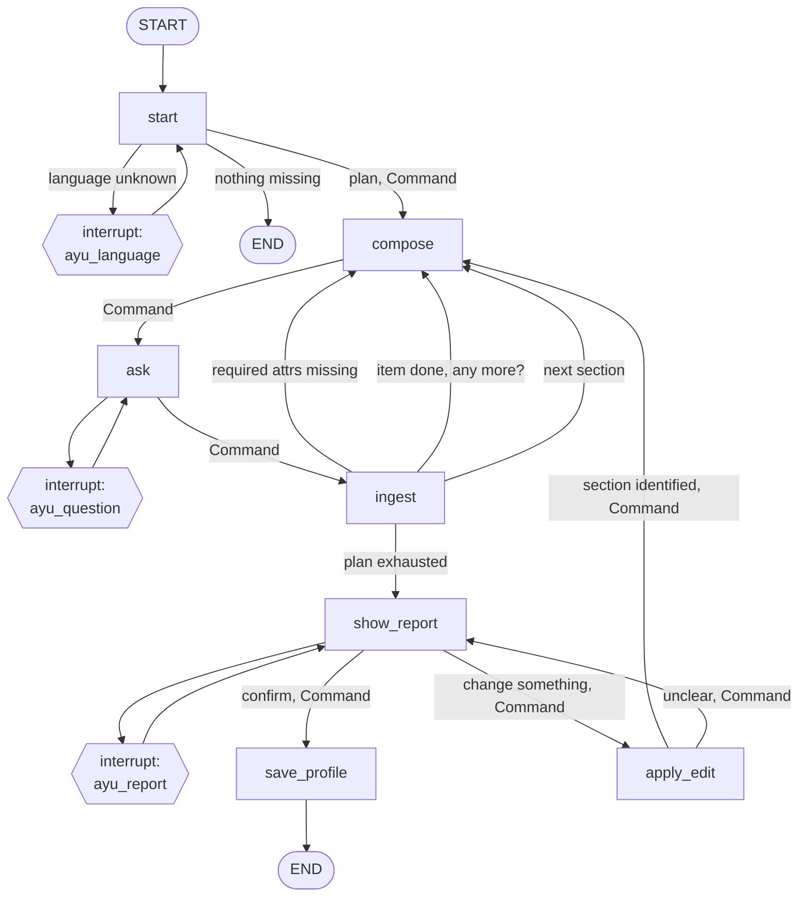

# AyuLink Agentic System

[`backend/`](../backend) runs **two** LangGraph agents — the one part of
AyuLink that isn't a plain Supabase CRUD call. This document is the
architecture reference: what each node does, how state flows, how a Neo4j
knowledge graph grounds the answers, and how the server streams all of it
to the client. For setup/running instructions see
[`backend/README.md`](../backend/README.md); for everything the platform
does outside these agents see [`FEATURES.md`](FEATURES.md).

| | **Diagnosis assistant** | **Ayu** |
|---|---|---|
| Surface | Patient app → Diagnosis tab | Patient app → floating bubble |
| Job | Symptom triage → doctor search → booking → post-care follow-up | Fills the patient's health profile |
| Shape | 22 nodes, 4 branches, LLM intent routing | 7 nodes; an interview planned per patient from what their profile is missing |
| Endpoints | `/chat`, `/chat/resume`, `/chat/pdf`, `/chat/image`, `/chat/followup`, `/chat/sync`, `/chat/history` | `/ayu/chat`, `/ayu/resume`, `/ayu/history`, `/ayu/status`, `/ayu/enabled`, `/ayu/snooze` |
| Package | `src/agent_workflow/retrevel/` | `src/agent_workflow/ayu/` |

**Sections 1–12 below describe the diagnosis agent.** Ayu has its own
section, [13](#13-ayu--the-health-profile-assistant).

They are separate graphs on purpose. One classifies free-form intent and
routes; the other runs a script to completion. Merging them would make
`manager_agent` responsible for telling "I have a headache" apart from an
answer to question 4 of an interview — a classification problem neither
agent needs to have. They share the FastAPI process, the Postgres
checkpointer and the LLM provider layer; not the graph.

## Contents

1. [What it does](#1-what-it-does)
2. [Tech stack](#2-tech-stack)
3. [Graph topology](#3-graph-topology)
4. [State (`GraphState`)](#4-state-graphstate)
5. [Nodes, in detail](#5-nodes-in-detail)
6. [Human-in-the-loop](#6-human-in-the-loop)
7. [Tools](#7-tools)
8. [LLM provider abstraction](#8-llm-provider-abstraction)
9. [Streaming protocol](#9-streaming-protocol)
10. [Persistence (checkpointing)](#10-persistence-checkpointing)
11. [API surface](#11-api-surface)
12. [Knowledge graph & ingestion](#12-knowledge-graph--ingestion)
13. [**Ayu** — the health-profile assistant](#13-ayu--the-health-profile-assistant)

---

## 1. What it does

One conversation thread can, without the patient switching screens:

- Extract and track symptoms across multiple turns, ask **at most a
  handful** of genuinely useful follow-up questions (never off habit),
  and explain a likely condition in careful, non-diagnostic language,
  grounded in a real medical knowledge graph rather than the LLM's own
  unconstrained guesses.
- Offer to find a doctor for the suggested specialty, or handle a direct
  "find me a cardiologist near Colombo" style request.
- Walk through location/time preference, show real availability pulled
  live from Postgres, and book (or reschedule/cancel) an appointment —
  writing to the same `Appointment` table every other app reads from,
  using the patient's own JWT so Postgres's row-level security applies
  exactly as it would from the mobile app itself.
- Accept a photographed medical report or a PDF upload and fold a
  summary of it into the conversation before continuing.
- Run an **end-of-course check-in** once a prescribed course of
  medication has finished — ask how the patient is doing, then either
  offer to mark the diagnosis **completed** (collecting a 1–5 star
  rating for every doctor actually seen for it first) or, if they're
  still unwell, steer them straight back into doctor search / booking
  honouring whatever follow-up the prescribing doctor set (see the same
  doctor again, or the doctor they were referred to). This turn is
  opened by the patient app from a local notification it scheduled for
  the course-end moment (`POST /chat/followup`), so it enters the graph
  directly rather than through intent classification.
- Fold everything that happened to the patient *outside* the chat — the
  doctor starting the visit, the prescription they issued, each drug a
  pharmacy dispensed — into the same thread on demand (`POST /chat/sync`),
  as plain appended messages that never re-trigger routing.

## 2. Tech stack

| Concern | Library |
|---|---|
| Web framework | FastAPI, served by Uvicorn, Server-Sent Events for streaming |
| Agent orchestration | LangGraph (`StateGraph`, conditional edges, `Command(goto=...)`, `interrupt()`/`Command(resume=...)`) |
| LLM/embeddings interface | LangChain (`BaseChatModel`, `Embeddings`) |
| LLM providers | `langchain-openai` (LM Studio, OpenRouter — both OpenAI-compatible) or `langchain-google-genai` (Gemini) — selected by one env var |
| Structured output | Pydantic v2 models via `with_structured_output(..., method="json_schema")` |
| Knowledge graph | Neo4j (official `neo4j` driver), Cypher, a vector index for embedding search |
| Conversation persistence | `langgraph-checkpoint-postgres` (`AsyncPostgresSaver`) over a `psycopg` async connection pool |
| Data access | `supabase` Python client, calling the exact same `app_*` RPCs the mobile apps use |
| PDF/image | PyMuPDF (page/text extraction, page-to-image rendering), a vision-capable LLM for image description |

## 3. Graph topology



The graph registers **22 nodes** (`build_graph_builder` in `agent.py`);
`manager_agent` routes to one of four branches.

- **Entry routing** (`_entry_router` in `agent.py`) picks the entry path
  once, at the very start of a turn, in this priority order: an
  app-initiated end-of-course check-in (`forced_route == "course_followup"`,
  set by `POST /chat/followup` — the patient hasn't typed anything, the
  assistant is opening the conversation), then a PDF upload, an image
  upload, then plain text. Both upload paths converge into
  `document_summarizer`, which folds a plain-language summary into the
  conversation as if the patient had typed it, then continues into
  `normalise_input` (a no-op passthrough — every downstream node reads
  state via `.get()` with defaults, so there's nothing to initialize).
- **`manager_agent`** is the only true router — every fresh turn passes
  through it, and it's also the node three different `interrupt()`-ing
  nodes hand control *back* to (via `Command(goto="manager_agent",
  update={"forced_route": ...})`) once the patient has answered a
  yes/no or picked something, so the manager doesn't need to
  re-classify an answer like `"yes"` — see `forced_route` in §4.
- **Four branches**, each internally loop-y (a node re-entering itself
  via a conditional edge, or a chain of `Command(goto=...)` hops, until
  it decides it's done), not independent linear pipelines:
  - **clinical**: `symptom_agent` → `disease_agent` ⇄ `ask_followup`
    (LLM decides each round whether to conclude or ask one more
    question) → `explain_condition_node` → `offer_doctor`.
  - **doctor_search**: `doctor_finder_agent` ⇄ `ask_location_time` ⇄
    `availability_check` → `present_top5` → `choose_slot` (a state
    machine driven by `route_after_doctor_finder`, not by nodes calling
    each other directly). Tapping "Book" on a shortlist card does **not**
    book: it routes to `choose_slot`, which shows that doctor's whole
    schedule with the card's slot preselected, and only a confirmed slot
    reaches `booking_agent`.
  - **booking**: `booking_agent` — either commits a slot that
    `present_top5` just interrupted for, or (no fresh slot, but a
    booking already exists on this thread) classifies free-text intent
    (cancel/reschedule/status) and acts on it directly, no re-search
    needed for a status check or cancellation.
  - **post-care** (entered only via `POST /chat/followup`):
    `course_followup` asks how the finished course went, then a chain of
    `Command(goto=...)` nodes — `offer_complete_treatment` /
    `start_doctor_ratings` ⇄ `rate_doctor_node` → `complete_treatment_node`
    on "better", or `offer_followup_booking` (→ back to `manager_agent`
    with a `doctor_search` forced route) on "still unwell". A diagnosis
    only ever reaches `COMPLETED` through this branch — the patient
    saying so — never because a channeling center closed the appointment.

## 4. State (`GraphState`)

A single `TypedDict` (`src/agent_workflow/retrevel/state.py`) threads
through every node. LangGraph merges each node's returned `dict` into it
automatically; `messages` uses `add_messages` (LangChain's
append-and-deduplicate-by-id reducer) so every node can just return new
messages to append rather than managing the full list.

Selected fields and why they exist (not just their types):

- **`route` / `forced_route`** — `route` is what `manager_agent` decided
  this turn; `forced_route` is a one-shot override set by a HITL node
  right before handing control back, consumed and cleared on the very
  next manager visit.
- **`symptoms`**, **`round`**, **`confidence`**, **`followup_history`** —
  the clinical branch's working memory. `followup_history` (a list of
  `{question, answer}` pairs) exists specifically so a later LLM call
  can see *which question produced which answer* — `symptoms` alone is
  just a flat bag of text with no memory of that link, which would let
  the model ask something it effectively already asked in different
  words.
- **`llm_ready_to_conclude`** / **`llm_followup_question`** — `disease_agent`
  writes both every round; `should_ask_followup` is a pure router that
  just reads the first, and `ask_followup` just asks whatever question
  was already decided — the decision and its execution are two separate
  nodes on purpose (routing has to be synchronous, one function
  returning a string; the LLM call that produces the decision is async
  and lives in `disease_agent`).
- **`doctor_pool`** vs **`top5`** — `doctor_pool` is every match from
  Postgres before availability is even checked; `top5` is the
  rating/soonest-ranked slice actually shown to the patient. Kept
  separate so `availability_check` can annotate the *whole* pool once
  without re-fetching it, and `present_top5` can re-rank without
  re-searching.
- **`selected_slot`** / **`booking_result`** / **`rescheduling_appointment_id`**
  — `selected_slot` is what the patient just picked (cleared immediately
  after a successful booking — see the "stale leftover" comment in
  `booking.py`, a real bug this graph had to be hardened against: a
  leftover `selected_slot` from a completed booking made a later "cancel
  my appointment" message re-attempt booking the same slot instead of
  falling through to the manage-existing-booking branch). `booking_result`
  is the current confirmed appointment, if any, and is what makes a
  reopened/continued thread default straight into the booking branch for
  follow-ups like "what's my appointment time again?".
- **`treatment_id`** — set by `explain_condition_node` after it persists a
  `Treatment` row (best-effort; a Postgres hiccup here must never break
  the diagnosis turn itself), later used by `booking_agent` to link that
  treatment to whatever appointment gets booked out of this same thread.
- **`followup_plan`** / **`followup_doctor`** / **`last_seen_doctor_id`** /
  **`preferred_doctor_id`** — the post-care branch's working memory.
  `course_followup` re-reads these from `app_treatment_timeline` rather
  than trusting state, because the prescription that carries the doctor's
  follow-up instruction (`MEET_SAME_DOCTOR` / `REFER_DOCTOR` / `NONE`) is
  written by the doctor app long after this thread's last turn and may
  not be in state at all. `offer_followup_booking` turns the plan into a
  `specialty_hint` / `preferred_doctor_id` for the reused doctor-search
  flow.
- **`rating_skipped`** — doctor ids the patient skipped rating in the
  current pass. `rate_doctor_node` re-queries `app_treatment_doctors_to_rate`
  every round (so the loop is crash-safe — which doctors are still unrated
  is always read from the DB, not cached in state); this list is the only
  per-pass state it keeps, to exclude a doctor the patient explicitly
  skipped from being re-asked.

## 5. Nodes, in detail

### `manager_agent`

One structured-output LLM call classifies the latest message into
`clinical` / `doctor_search` / `booking`, using the last 6 messages as
context. There is **no general-purpose catch-all route** — `clinical` is
the default for anything ambiguous, deliberately, since a medical
assistant should lean toward triage rather than punting to a generic
chat response.

A keyword pass runs alongside the LLM call and matters in one specific
way: `booking` is a route a small/local LLM tends to over-pick for any
vaguely help-seeking message when it's one of only three options. An
LLM verdict of `booking` is **downgraded** (falls back to the keyword
result, or `clinical`) unless there's real corroborating signal — an
explicit booking-management keyword in the message, or the thread
already has a `booking_result`. This is the one place in the graph where
the LLM's structured-output verdict is deliberately second-guessed
rather than trusted outright, and the reasoning is recorded directly in
the module docstring, not just here.

### `symptom_agent`

Extracts normalized, catalog-style symptom phrases from the last 4
messages via structured output (falls back to a small keyword list —
headache, fever, cough, etc. — if the LLM call fails), and merges them
into `state["symptoms"]` with de-duplication (`dict.fromkeys` preserves
first-seen order without a manual seen-set).

### `disease_agent`, `should_ask_followup`, `ask_followup`

This is the core of the clinical branch, and the part most worth reading
the source of directly (`subagents/disease.py`) — it's intentionally
**not** a fixed "ask N questions then conclude" state machine:

1. Calls `find_diseases_for_symptoms_hybrid()` (see §7) against every
   symptom on record, producing ranked candidate diseases with a match
   score.
2. Computes a **confidence** score from that match — but penalizes ties:
   a common symptom like "fever" trivially matches many diseases
   equally, which would read as artificially high confidence off the
   raw ratio alone. The score is divided by how many candidates are
   tied at the top match count.
3. A **hard ceiling** (`MAX_FOLLOWUP_ROUNDS`, env-configurable, default
   5) forces a conclusion regardless of what the LLM would otherwise
   decide — the graph must terminate somewhere. This is the *only* case
   that skips the LLM decision call entirely.
4. A **floor** (`MIN_SYMPTOMS_BEFORE_DIAGNOSIS = 3`) prevents concluding
   off just one or two mentioned symptoms no matter how confident the
   raw match looks — but this still asks the LLM for a genuinely
   dynamic question (`force_continue=True`), it just isn't given the
   option to say "done" yet. It is not a canned-question fallback path.
5. Otherwise, **one LLM call** (`FollowupDecision` structured output)
   decides *both* whether enough is known to conclude and, if not, the
   single best next question — informed by the graph-retrieved
   candidates and their differentiating symptoms (queried via
   `get_symptoms_for_diseases`, ranked so a symptom shared by every tied
   candidate sorts last, since it doesn't help distinguish between
   them), but not mechanically constrained to pick from that list. The
   prompt explicitly tells the model not to ask out of habit — conclude
   now on a classic, mild, non-urgent presentation rather than padding
   the conversation.

`should_ask_followup` is a one-line router reading `llm_ready_to_conclude`.
`ask_followup` asks whatever question was already decided (via
`interrupt()` — see §6), appends the answer to both `symptoms` and
`followup_history`, and increments `round`.

### `explain_condition_node`

Writes the patient-facing explanation for the top candidate disease —
deliberately hedged language throughout ("it seems like this could be…",
never "you have X"), recommends seeing the matched specialty as a next
step, and ends with a non-diagnosis disclaimer. Best-effort persists a
`Treatment` row via `create_treatment()` (Postgres RPC) so the diagnosis
is visible/resumable later in the Treatments tab — a failure there is
swallowed, not surfaced, since it must never break the diagnosis turn
itself.

### `offer_doctor`

Asks whether the patient wants a doctor found for the matched specialty
— phrased as "a specialist in {specialty}", except `General Practitioner`
(already reads as a role, not a field, so it skips the "specialist in"
framing) and the no-specialty case (generic "find a doctor" offer). A
"yes" hands control to `manager_agent` with `forced_route: "doctor_search"`
and `specialty_hint` set (so `doctor_finder_agent` doesn't have to
re-extract the specialty from free text); a "no" ends the turn.

### `doctor_finder_agent`, `route_after_doctor_finder`, `ask_location_time`, `availability_check`, `present_top5`, `choose_slot`

A state machine re-entering `doctor_finder_agent` through two loop-back
edges, staged by `route_after_doctor_finder` reading
`location_asked`/`availability_annotated`, then a two-step commit
(shortlist → exact slot → book):

1. **No pool yet** → resolve what's being searched for (`_resolve_query`:
   an explicit `specialty_hint` short-circuits everything else;
   otherwise a structured-output call extracts specialty/city/doctor
   name/symptoms and flags whether this looks like an everyday,
   non-specific complaint that should go to a `General Practitioner`
   rather than a specialist), canonicalize any extracted specialty
   against the *real* Neo4j `Specialty` names (`_match_specialty_name` —
   a dynamically-built `Literal` schema constrains the LLM to one of the
   graph's actual values, so "cardiologist" resolves to "Cardiology"
   without the model ever being able to hallucinate a specialty that
   doesn't exist), then call `search_doctors()` (Postgres RPC).
   A city with no match for that specialty is **widened rather than
   returned empty** (`_search_with_city_fallback`) — but the widening is
   always reported back in `search_relaxation`, so the patient is told
   "no Cardiology in Akkaraipattu, showing the nearest instead" instead
   of being quietly handed results from somewhere else.
2. **Pool exists, location not asked** → route to `ask_location_time`,
   which `interrupt()`s for where/when. This is a **structured picker,
   not free text**: the payload carries the real `app_list_cities()`
   list, the bookable date window, and the three time bands, so the
   client renders a searchable city dropdown, an availability calendar,
   and morning/afternoon/evening chips. Everything is optional — all
   blank still means "nearest, soonest". Then it loops back, re-searching
   if a real city came back.
3. **Location asked, availability not annotated** → route to
   `availability_check`, which fetches **every** block each pooled doctor
   holds over `LOOKAHEAD_DAYS` (21) via `get_doctor_availability()`,
   drops anyone with none, and picks as the card's headline whichever
   block best matches the patient's date/band (`_rank_slot`) — not merely
   the soonest, so a card tapped after asking for "Tuesday evening"
   already shows Tuesday evening. The full list rides along on the card
   (`slots`) so the picker in step 5 needs no second round trip.
4. **Both done** → `present_top5` ranks by *preference first* (right day,
   then right part of day), rating second — a 4.9 doctor free three weeks
   out is not a better answer to "Tuesday morning" than a 4.2 who is
   actually free then. It caps at `MIN_RESULTS` (5) and attaches a `note`
   describing any drift from what was asked (wrong day, widened city), so
   the shortlist is never silently different from the request.
5. **A doctor is tapped** → `present_top5` returns
   `Command(goto="choose_slot")`. **Nothing is booked yet.** `choose_slot`
   `interrupt()`s with that doctor's whole schedule and the card's slot
   preselected; the patient can move to any other date/time before
   confirming. Confirming hands off to `manager_agent` with
   `forced_route: "booking"` and the chosen slot in `selected_slot`;
   backing out returns to `doctor_finder_agent` (clearing
   `availability_annotated`) so the shortlist is rebuilt rather than the
   turn dead-ending on an unanswerable interrupt.

   This split is the reason "Book" is safe to tap. Previously the button
   committed whatever slot the card happened to be showing, so changing
   the time meant cancelling and starting over; the same picker is now
   also what the Appointments tab uses for manual booking and
   rescheduling, so both paths are one interaction rather than two that
   drift apart.

### `booking_agent`, `_commit_booking`, `_cancel_booking`, `_retry_after_race`

Three jobs, decided by what's already in state:

1. **A fresh slot was just picked** → `_commit_booking`: generates a
   symptom-only booking reason via a dedicated LLM call (never the
   disease name — a doctor should form their own diagnosis, not read an
   AI guess off the appointment record), then calls
   `book_appointment()` or, if this is a reschedule-in-progress,
   `reschedule_appointment()`. On a "slot just taken" race (someone else
   booked it between `present_top5` and now), `_retry_after_race`
   refreshes that doctor's availability and re-`interrupt()`s with the
   next soonest slot instead of just failing the turn. Success clears
   `selected_slot`/`top5` — necessary so a following "cancel my
   appointment" message doesn't find a stale "fresh" slot and try to
   re-book it.
2. **No fresh slot, but a booking already exists on this thread** →
   classify intent (cancel / reschedule / rebook / new_booking / status)
   via structured output, and act directly:

   The classifier is **vetoed by a keyword pass** (`_keyword_intent`), the
   same deliberate second-guessing `manager_agent` applies to its own
   `booking` route, for the same reason: the mistake is asymmetric. "Cancel
   this and give me a today appointment" is genuinely ambiguous phrasing,
   and an LLM asked for one label lands on `reschedule` about as often as
   `cancel` — leaving a real appointment standing that the patient believes
   they cancelled. So an explicit cancel word may only resolve to `cancel`
   or `rebook`; the LLM still chooses between those two, since it reads
   "and find me another" better than a word list does.

   `rebook` (cancel *and* replace) cancels first, then hands off to a
   fresh search — the patient gave an explicit instruction to cancel, and
   holding the appointment back in case the search comes up short would
   mean quietly not doing the thing they asked for. `new_booking` (an
   additional appointment, keeping this one) searches without cancelling. cancel calls
   `cancel_appointment()` and best-effort unlinks the `Treatment`;
   reschedule goes to `_start_reschedule`, which loads that doctor's
   remaining slots **at the same channeling centre only** and jumps
   straight to `choose_slot` with `rescheduling_appointment_id` set, so
   the eventual `_commit_booking` calls `reschedule_appointment()`
   instead of a fresh `book_appointment()`; status just formats the
   existing booking into a message.

   Rescheduling deliberately skips the search entirely. Sending someone
   re-picking a time back through "which city? which doctor?" is a
   re-booking, not a reschedule — and offering the same doctor's slots at
   a clinic on the other side of the island is a good way to send a
   patient to the wrong building. Wanting a different doctor or centre is
   a cancel-then-book, which the cancel intent already handles. Backing
   out of the picker mid-reschedule ends the turn with the existing
   appointment untouched, rather than falling through to a doctor
   search.
3. **Neither** → a plain "please pick a doctor first" message.

### `course_followup` (post-care branch entry)

Entered only from `_entry_router` when `forced_route == "course_followup"`
(`POST /chat/followup`). Re-reads the treatment's timeline
(`treatment_by_thread` → `treatment_timeline`) to recover the
`followupPlan` and any referred doctor from the `PRESCRIPTION_ISSUED`
event — deliberately not trusting graph state, since the prescription is
written by the doctor app well after this thread's previous turn. One LLM
call writes a short, warm "how are you feeling now?" message (falls back
to a fixed sentence on any LLM hiccup — never strand the patient),
`interrupt()`s for the answer, then a second structured-output call
(`FollowupOutcome`) classifies it as resolved / not — ambiguous or
off-topic is treated as **not** resolved, since keeping a diagnosis open
is safer than wrongly closing one. Routes via `Command` to
`offer_complete_treatment` (resolved) or `offer_followup_booking` (not).

### `offer_complete_treatment` / `start_doctor_ratings` / `rate_doctor_node` / `complete_treatment_node`

The "patient is better" tail. `offer_complete_treatment` `interrupt()`s a
yes/no; "no" ends the turn leaving the diagnosis open. "Yes" routes to
`start_doctor_ratings`, which lists every doctor actually *seen* for this
diagnosis and not yet rated (`app_treatment_doctors_to_rate` — a booking
that never became a started visit doesn't count) and routes straight to
`complete_treatment_node` if there's nobody to rate. Otherwise
`rate_doctor_node` asks about one doctor at a time, re-querying the DB
each round (crash-safe — the still-unrated set is never cached in state;
only `rating_skipped` is) and `interrupt()`ing with a `rate_doctor`
payload. Unlike every other interrupt in the graph, the resume value here
is a **structured value the client sends directly** —
`{"rating": 1–5, "feedback": str | null}` or `{"skip": true}` — because
the app renders a real star picker, so there's nothing for an LLM to
parse. `rate_doctor` persists each rating best-effort (`app_rate_doctor`),
loops back for the next doctor, and finally falls through to
`complete_treatment_node`, which calls `app_complete_treatment` (on
failure: tell the patient they can complete it from the Diagnoses tab).

### `offer_followup_booking`

The "patient is still unwell" tail. Phrases the offer around whatever the
prescribing doctor set — `REFER_DOCTOR` names the referred doctor,
`MEET_SAME_DOCTOR` points back to the same one, `NONE` is a generic "find
you a doctor" — then `interrupt()`s a yes/no. "No" ends the turn. "Yes"
hands control to `manager_agent` with `forced_route: "doctor_search"` and,
where known, a `specialty_hint` / `preferred_doctor_id`, so the normal
search/booking flow is reused rather than duplicated here.

## 6. Human-in-the-loop

Ten nodes call LangGraph's `interrupt()`: `ask_followup`, `offer_doctor`,
`ask_location_time`, `present_top5`, `choose_slot`, `_retry_after_race` (inside
`booking_agent`), and the post-care branch's `course_followup`,
`offer_complete_treatment`, `rate_doctor_node`, and
`offer_followup_booking`. Each pauses the graph mid-run and emits its
payload as the SSE `interrupt` event (see §9); the mobile app renders the
appropriate UI (a text question, a yes/no, a city/date/time picker, a list
of doctor cards, a schedule picker, a star-rating picker) and the *next* HTTP call is
`POST /chat/resume` with whatever the patient answered, which the server
turns into `Command(resume=value)` — LangGraph resumes execution of that
exact node with `interrupt()`'s return value being whatever was passed
in, continuing the run from there rather than restarting the turn. Most
resume values are plain text an LLM then interprets; `rate_doctor_node`
is the exception, taking a structured `{rating, feedback}` / `{skip}`
object straight from the client.

This is why the graph is checkpointed (§10): a resume has to reload
exactly where the run paused, potentially in a different HTTP request
served by a different worker.

## 7. Tools

### `tools/neo4j_tools.py` — the knowledge graph

`find_diseases_for_symptoms_hybrid()` is the primary disease-lookup
entry point, used by both `disease_agent` (clinical triage) and
`doctor_finder_agent` (`_specialty_from_graph`, for a direct "find me a
doctor, I have chest pain" query). For each patient symptom phrase, it
combines:

- an exact-ish `CONTAINS` substring match against `Symptom.name`
  (weight `1.0` — an exact catalog term should always outrank a merely
  similar one), and
- a cosine-similarity search over the `symptom_embedding_idx` vector
  index (weight = the similarity score, discarded below
  `SYMPTOM_VECTOR_SIMILARITY_FLOOR = 0.55` so a barely-related symptom
  can't quietly inflate a disease's match weight),

then walks `Symptom<-[:HAS_SYMPTOM]-Disease<-[:MANAGES]-Specialty` and
aggregates per disease, so phrasing that doesn't literally contain a
catalog term (e.g. "tummy ache" vs. "abdominal pain") can still surface
the right node. If embedding the patient's phrases fails for any reason
(provider down, no embedding model loaded), it transparently falls back
to `find_diseases_for_symptoms()` — the same traversal, `CONTAINS`-only,
no embedding call at all.

Every query runs via `session.execute_read()` (a managed transaction),
never a bare `session.run()` — Neo4j Aura's connections routinely go idle
and stale between requests in a long-running server process, and only
managed transactions get the driver's automatic retry on that class of
transient connection error.

Also here: `list_specialty_names()` (every real `Specialty` name, used to
canonicalize free-text specialty mentions) and
`get_symptoms_for_diseases()` (grounds follow-up questions in the graph's
actual symptom data rather than the LLM inventing plausible-sounding
ones).

### `tools/postgres_tools.py` — the same RPCs the mobile apps use

Thin wrappers over `supabase.rpc()`, each authenticated with the
*patient's own JWT* (`client.postgrest.auth(jwt)`) so `auth.uid()`
resolves correctly inside every `app_*` function and Postgres's RLS/role
checks apply exactly as if the patient had called it from the app
directly — the agent has no elevated database access of its own.
`RpcError` wraps any failure into a readable string the graph can surface
in a chat message rather than a raw exception.

### `tools/pdf_tools.py` — report ingestion

`extract_pages()` uses PyMuPDF to pull text per page; a page with too
little extractable text (a scanned/image-only page, `< 40` chars) is
instead rendered to a PNG and described by the vision-capable LLM
(`describe_image()`). Both paths degrade gracefully — no vision model
loaded just yields a placeholder telling the patient to describe their
symptoms in their own words instead of failing the upload outright.

## 8. LLM provider abstraction

Every call site imports `text_llm`, `vision_llm`, `embed_texts()` /
`embed_text()` from `utils/llm.py` and never touches a provider-specific
class directly — switching providers is one `.env` value
(`LLM_PROVIDER=lm_studio|google|openrouter`) and a restart, no code
changes anywhere else. All three provider paths implement the same
LangChain interfaces (`invoke()`, `with_structured_output()`,
`embed_documents()`/`embed_query()`), including accepting the same
OpenAI-style `image_url` content blocks `pdf_tools.py` sends for vision
calls — `langchain-google-genai` accepts that shape too, so no
provider-specific branching is needed at any call site outside this one
file.

Extended "reasoning"/"thinking" tokens are disabled everywhere on
purpose — every call in this graph is a short classification, extraction,
or chat turn where that reasoning is pure latency and token-cost
overhead, not a better answer (measured live against one OpenRouter
model: reasoning on spent more than half the completion tokens on
reasoning alone for a trivial call, at roughly 11× the cost of the same
call with it off).

## 9. Streaming protocol

`src/api/sse.py`'s `stream_graph_events()` drives
`graph.astream(..., stream_mode=["messages", "updates", "custom"])` and
maps it to a small SSE vocabulary:

| Event | When | Payload |
|---|---|---|
| `token` | A streamed chunk of an LLM's plain-text reply | `{"content": "..."}` |
| `thinking` | A structured-output call is in flight (see below) | `{"message": "..."}` |
| `node` | The first time a node produces an update this run | `{"node": "disease_agent"}` |
| `cards` | `present_top5` just wrote `top5` to state | `{"doctors": [...]}` |
| `interrupt` | A node called `interrupt()` — the run is paused | whatever that node passed to `interrupt()` |
| `done` | The run reached a real end (no pending interrupt) | `{}` |
| `error` | Any exception during the run | `{"message": "..."}` |

**Why `thinking` exists**: `with_structured_output(..., method="json_schema")`
calls (most of the LLM calls in this graph — routing, symptom extraction,
follow-up decisions, intent classification) don't stream token-by-token;
without something filling the gap, the client would see dead air for
however long that call takes. `streaming.py`'s `emit_thinking()` pushes a
short status string through LangGraph's **custom stream writer** — a side
channel that never touches graph state, so these strings are never part
of `messages`, never reach the Postgres checkpointer, and are never
replayed back to the LLM as conversation history on a later turn. They
exist purely for that one SSE connection, purely for UX.

Token deduplication: some backends (observed with certain LM Studio
models) emit a final aggregate chunk repeating the whole message after
already streaming it token-by-token. The stream tracks accumulated text
per source node and silently drops an exact duplicate rather than
double-printing it client-side.

## 10. Persistence (checkpointing)

`src/api/checkpointer.py` wraps `AsyncPostgresSaver` (from
`langgraph-checkpoint-postgres`) over a `psycopg` `AsyncConnectionPool`,
opened once at FastAPI startup and reused for the process lifetime. Two
details that matter operationally, both documented in the module itself:

- The connection string **must** point at a *session-mode* Postgres
  connection (direct `:5432`, or Supabase's session pooler) —
  transaction-mode pooling doesn't support the server-side prepared
  statements `AsyncPostgresSaver` relies on.
- The pool is opened with `check=AsyncConnectionPool.check_connection`
  and `max_idle=120` — Supabase's pooler silently closes idle backend
  connections, and without a liveness check the pool would hand out a
  dead connection and fail the in-flight request instead of
  transparently reconnecting.

Every turn's full state (including pending interrupts) is checkpointed
per `thread_id`, which is how `/chat/resume` and `/chat/history` (§11)
can pick up a conversation from a completely different request, worker,
or day.

## 11. API surface

All under `backend/app.py`, all requiring `Authorization: Bearer <patient JWT>`
except `/health`:

| Endpoint | Purpose |
|---|---|
| `GET /health` | Liveness check |
| `POST /chat` | Start/continue a turn with a plain text message. SSE stream. |
| `POST /chat/resume` | Resume a paused (`interrupt()`ed) turn with the patient's answer. SSE stream. |
| `POST /chat/pdf` | Start/continue a turn with a PDF upload (multipart). SSE stream. |
| `POST /chat/image` | Start/continue a turn with an image upload (multipart). SSE stream. |
| `POST /chat/followup` | Open the end-of-course check-in on a diagnosis — enters the graph directly at `course_followup` with an empty message (the assistant speaks first). SSE stream. |
| `POST /chat/sync` | Non-streaming: fold the out-of-chat care events (visit started, prescription issued, items dispensed) for this thread's `Treatment` into its message history as appended messages, without running the graph or disturbing a pending interrupt. Idempotent via the timeline's stable event keys. Also returns `status`, `followupPlan`, dispensed `drugs`, and `courseEndsAt` for the app to schedule its local course-end notification. |
| `GET /chat/history?thread_id=` | Non-streaming: the current message transcript + any pending interrupt for a thread, so the app can hydrate a reopened conversation (e.g. reopening a Treatment) without replaying the whole graph. |

The JWT itself isn't cryptographically verified by this service — Supabase
already enforces it (an invalid/expired token fails every downstream RPC
call, which surfaces as a normal graph error); only the `sub` claim is
decoded, for the `patient_id` carried in graph state.

## 12. Knowledge graph & ingestion

The Neo4j graph is `Specialty --[:MANAGES]--> Disease --[:HAS_SYMPTOM]--> Symptom`,
seeded from `Dataset_ref/` (specialty/clinical taxonomy, disease catalog,
symptom ontology CSVs at the repo root — doctors and channeling centers
in that same folder are separately bulk-imported into **Postgres**, not
Neo4j; see `docs/README.md` §8) by
`backend/src/agent_workflow/ingestion/seed_neo4j.py`:

```bash
cd backend/src/agent_workflow/ingestion
pip install -r requirements.txt   # separate from backend/requirements.txt
python3 seed_neo4j.py
```

Safe to rerun — it only embeds `Symptom` nodes that don't already have an
embedding, using whichever provider `LLM_PROVIDER` currently points at.
If that provider is unreachable, the graph still seeds and the
embedding/vector-index step is skipped with a warning; hybrid retrieval
then runs `CONTAINS`-only until it's rerun with the provider up.

**Changed `LLM_PROVIDER` or an `*_EMBEDDING_MODEL` value?** A different
embedding model's vectors aren't dimension-compatible with the old ones —
run `python3 seed_neo4j.py --reset-embeddings` to drop
`symptom_embedding_idx`, clear every `Symptom.embedding`, and re-embed
everything at the new provider's vector size.

---
## 13. Ayu — the health-profile assistant

A second graph (`src/agent_workflow/ayu/`), reached on its own `/ayu/*`
endpoints. It fills the patient's health profile by conversation — the
background a doctor reads the moment they scan a Medical ID — in English
or Sinhala, and re-checks monthly for anything still blank.

It is **not** a fixed questionnaire. Every run begins by reading what is
already on file; the LLM decides what to ask and in what order, writes
each question itself, and a section is not finished until every attribute
that makes the entry usable has been given or explicitly declined.

### 13.1 Graph topology



Seven nodes, of which the loop is three: **compose → ask → ingest**.

That split exists for one structural reason. A LangGraph node re-runs from
the top on every resume, so a node that calls `interrupt()` must do
nothing non-deterministic before it. `compose` makes the LLM call that
writes the question; `ask` only *reads* `pending_question` and interrupts;
`ingest` reads the answer back. Composing inside the asking node would
re-roll the wording on resume — showing the patient one question and
recording another.

### 13.2 The four rules that carry the design

**UNKNOWN is not NONE.** Every list section stores a `*_status` of
UNKNOWN / NONE / LISTED:

| The patient said | Stored |
|---|---|
| "Penicillin, I get a rash" | `LISTED` + the entry |
| "No, none" | `NONE` |
| "I don't remember" | `UNKNOWN` |

"No known drug allergies" is a clinical statement; "nobody asked" is the
absence of one, and a doctor reading an empty list must be able to tell
which they are looking at. That boolean is **not left to the LLM alone** —
`guards.said_dont_know` / `said_no` overrule it, because the same Sinhala
sentence was observed parsing both ways on consecutive calls. Order
matters: don't-know is checked first, since "I don't remember" contains a
negation too.

**An entry is not usable until it is complete.** Each attribute in
`schema.py` is marked `required` or not, and a required one that is still
empty produces a follow-up asking *only* for what is missing — by name.
"Diabetes" with no relative, a vaccination with no year, or an emergency
contact that is a name and nothing else are all half-entries that look
complete. Each attribute is chased **once**: enough to catch "I forgot to
say", bounded so a patient who genuinely doesn't know is not asked
forever.

**A guess is not an answer.** The extractor will fill a required field
from the *question* rather than the answer if allowed to: asked "any
conditions that run in your family?", "yes diabetes" came back as
`relationship="Parent"` — and because a filled required field is what
stops Ayu asking, that guess silently suppressed the "which relative?"
follow-up. `guards.relationship_was_said` keeps a relative only if the
patient actually named one. Inference is welcome elsewhere (prawns really
are a `FOOD`); here it is exactly wrong, because *who* has it is the
entire content of the answer.

**Talk in Sinhala, store in English.** Doctors, the drug catalogue and the
Neo4j graph are English-only. Every extraction prompt says so — and
because "always answer in English" holds most of the time and then quietly
doesn't, `guards.is_latin` checks every value on the way out and
`to_latin` re-translates the ones that came back in Sinhala script.
Medical terms are translated (`මෙට්ෆෝමින්` → `Metformin`); personal and
place names are transliterated, never translated. Verified end to end: a
wholly Sinhala conversation stores `Metformin / 500mg / Twice a day`.

### 13.3 The section schema

`schema.py` is the single source of truth. The planner reads it to see
what is empty, the extractor builds its Pydantic model from it, the
composer is told which attributes it is chasing, and the save step maps
items back onto `app_save_my_health_profile`.

| Section | Shape | Required attributes |
|---|---|---|
| Allergies | LIST | allergen, kind (DRUG/FOOD/ENVIRONMENTAL/OTHER) |
| Long-term conditions | LIST | condition |
| Regular medicines | LIST | drugName, dosage, frequency |
| Surgeries & hospital stays | LIST | label, admitted *(decides SURGERY vs HOSPITALISATION)* |
| Family history | LIST | label, relationship |
| Vaccinations | LIST | label, year |
| Implants & devices | LIST | label |
| Body & blood | SCALAR | — |
| Pregnancy *(female only)* | SCALAR | pregnancyStatus |
| Lifestyle | SCALAR | smoking, alcohol, betel |
| Emergency contact | SCALAR | name, relationship, phone |

Eleven sections; ten for a patient who is not female. Two notes worth
keeping: betel is asked explicitly because it is a leading oral-cancer
risk factor in Sri Lanka, and the three lifestyle habits are independent —
a "no" about smoking must not carry over to alcohol in the same sentence.
Family history carries **no year**: nobody reliably knows when a parent's
diabetes started, and `since` is a `date` column that cannot hold
year-only precision (`'2015'::date` is a hard error, and `2015-01-01`
would show a doctor "since 1 January" that nobody said).

### 13.4 The three LLM roles

**PLAN** (`llm_io.plan_sections`) — given a summary of what is on file and
the sections still unanswered, return them ordered by clinical importance.
There is a deterministic floor under it: anything genuinely empty that the
planner leaves out is appended anyway. The model chooses an *order* and
can pull in something that looks wrong; it cannot silently drop a gap.

**COMPOSE** (`llm_io.compose_question`) — write the next question, in the
patient's language, for one of three phases: `OPEN` (do you have any?),
`DETAIL` (chase these named attributes), `MORE` (anything else?). It is
told what is already collected and instructed never to re-ask it.

**EXTRACT** (`llm_io.extract_list_opening` / `extract_attrs`) — read the
answer into that section's attributes. The models are built **per section**
with `create_model`, so a section's model contains only its own fields. A
single shared shape let the LLM fill a field belonging to another question
— an implant came back carrying a severity, a frequency and a family
relationship — and every consumer then had to remember to ignore what it
had not asked for. A model that lacks the field cannot make that mistake.

Every one of the three degrades to something usable when the call fails: a
composed question falls back to a templated one, extraction falls back to
"nothing was understood", and an extraction failure is recorded as
UNKNOWN — never as "the patient has none", which would be a clinical claim
nobody made. Ayu going quiet mid-interview is worse than Ayu asking a
plainer question.

### 13.5 The "anything else?" loop

After each completed item a LIST section asks whether there is another.
An answer that already names it — "yes, also prawns" — is read straight
away rather than making the patient repeat themselves.

Negation is checked **before** affirmation here, and that ordering is
load-bearing: Sinhala `නෑ, තව නෑ` means "no, no more" but contains `තව`
("more"), so an affirmation-first read turned a refusal into another round
of questions.

An item that reaches commit without its primary attribute — a medication
with no drug name — is **dropped, not stored**: `drug_name` is NOT NULL, so
it would be discarded at save time anyway, after the patient had been told
it was written down. If a section ends with the patient having said "yes"
but nothing usable captured, its status is reconciled back to UNKNOWN
rather than left as LISTED-with-nothing-under-it.

### 13.6 Report, edit, save

`show_report` renders everything gathered in the patient's own language,
with the English values inside it, and interrupts. Nothing has reached the
database at this point — a health profile is read by clinicians who will
act on it, so the patient sees exactly what will be stored before it is.
Confirming saves; asking for a change routes to `apply_edit`, which
identifies the section, clears just that section's drafts and re-opens it.

Values are rendered as labels, not internals: `Blood group: O+`,
`Height: 175 cm`, `Smoking: Never` — the drafts carry the payload's own
field names and the database's enum values, and both used to be printed
raw at the patient.

### 13.7 Interrupt vocabulary

| Type | Client renders | Resume value |
|---|---|---|
| `ayu_language` | Two buttons | `"EN"` / `"SI"` |
| `ayu_question` | Question + text box + an **"I don't know"** button | the answer text |
| `ayu_report` | The rendered summary + Confirm / Change | `{confirm: true}` or `{edit: "..."}` |

"I don't know" is a first-class button, not something to type. It records
UNKNOWN rather than a false NONE, and making it the easy path is what
stops people guessing.

`ask` is listed in `INTERRUPT_ECHO_NODES` (`src/api/sse.py`): it both
persists its question into `messages` and delivers it as an interrupt, so
its message stream is suppressed. Without that the client renders every
question twice — once from the interrupt, once from the resumed stream.

### 13.8 On/off, and the monthly check

`PatientProfile.ayu_enabled`, `ayu_last_prompted_at` and
`profile_completed_at` drive whether the bubble shows and whether a
check-in is due. `dueForCheckin` is a month since the last nudge **and**
something genuinely still missing, so a complete profile is never nagged.

The patient app reads that state **from Supabase, not from `/ayu/status`**,
even though the endpoint computes the same thing. Routing it through the
agent made the controls depend on that service being awake: a sleeping
free-tier backend returned an error, and both the bubble *and* the
off-switch disappeared — leaving anyone who had turned Ayu off with no
way to turn it back on. A toggle must not depend on the thing it toggles
being reachable. The endpoints remain for server-side callers.
