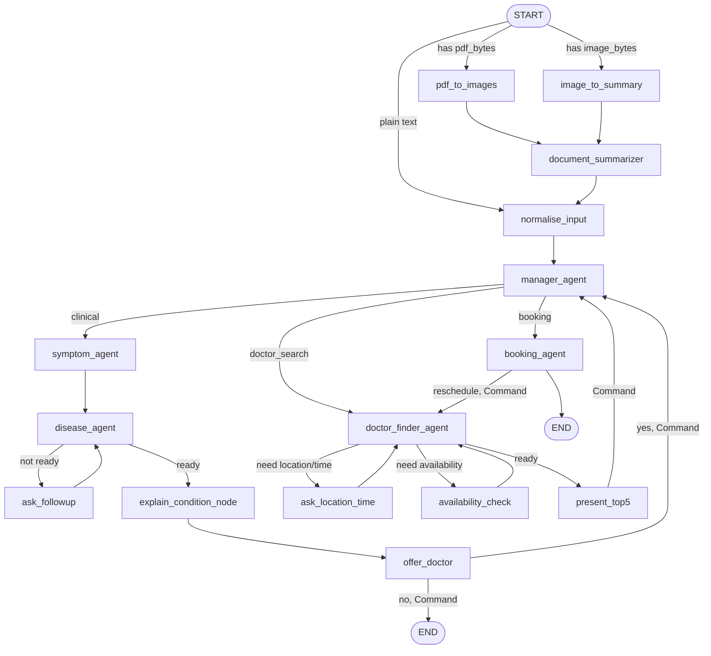

# AyuLink Agentic System

The patient app's **Diagnosis** (Assistant) tab is backed by a LangGraph
multi-agent system in [`backend/`](../backend) — the one part of AyuLink
that isn't a plain Supabase CRUD call. This document is the architecture
reference: what each node does, how state flows, how a Neo4j knowledge
graph grounds the AI's answers, and how the server streams all of it to
the client. For setup/running instructions, see
[`backend/README.md`](../backend/README.md).

## Contents

1. [What it does](#1-what-it-does)
2. [Tech stack](#2-tech-stack)
3. [Graph topology](#3-graph-topology)
4. [State (`GraphState`)](#4-state-graphstate)
5. [Nodes, in detail](#5-nodes-in-detail)
6. [Human-in-the-loop](#6-human-in-the-loop)
7. [Tools](#7-tools)
8. [LLM provider abstraction](#8-llm-provider-abstraction)
9. [Streaming protocol](#9-streaming-protocol)
10. [Persistence (checkpointing)](#10-persistence-checkpointing)
11. [API surface](#11-api-surface)
12. [Knowledge graph & ingestion](#12-knowledge-graph--ingestion)

---

## 1. What it does

One conversation thread can, without the patient switching screens:

- Extract and track symptoms across multiple turns, ask **at most a
  handful** of genuinely useful follow-up questions (never off habit),
  and explain a likely condition in careful, non-diagnostic language,
  grounded in a real medical knowledge graph rather than the LLM's own
  unconstrained guesses.
- Offer to find a doctor for the suggested specialty, or handle a direct
  "find me a cardiologist near Colombo" style request.
- Walk through location/time preference, show real availability pulled
  live from Postgres, and book (or reschedule/cancel) an appointment —
  writing to the same `Appointment` table every other app reads from,
  using the patient's own JWT so Postgres's row-level security applies
  exactly as it would from the mobile app itself.
- Accept a photographed medical report or a PDF upload and fold a
  summary of it into the conversation before continuing.

## 2. Tech stack

| Concern | Library |
|---|---|
| Web framework | FastAPI, served by Uvicorn, Server-Sent Events for streaming |
| Agent orchestration | LangGraph (`StateGraph`, conditional edges, `Command(goto=...)`, `interrupt()`/`Command(resume=...)`) |
| LLM/embeddings interface | LangChain (`BaseChatModel`, `Embeddings`) |
| LLM providers | `langchain-openai` (LM Studio, OpenRouter — both OpenAI-compatible) or `langchain-google-genai` (Gemini) — selected by one env var |
| Structured output | Pydantic v2 models via `with_structured_output(..., method="json_schema")` |
| Knowledge graph | Neo4j (official `neo4j` driver), Cypher, a vector index for embedding search |
| Conversation persistence | `langgraph-checkpoint-postgres` (`AsyncPostgresSaver`) over a `psycopg` async connection pool |
| Data access | `supabase` Python client, calling the exact same `app_*` RPCs the mobile apps use |
| PDF/image | PyMuPDF (page/text extraction, page-to-image rendering), a vision-capable LLM for image description |

## 3. Graph topology



- **Entry routing** (`_entry_router` in `agent.py`) picks the ingestion
  path once, at the very start of a turn: a PDF upload, an image upload,
  or plain text. Both upload paths converge into `document_summarizer`,
  which folds a plain-language summary into the conversation as if the
  patient had typed it, then continues into `normalise_input` (a no-op
  passthrough — every downstream node reads state via `.get()` with
  defaults, so there's nothing to initialize).
- **`manager_agent`** is the only true router — every fresh turn passes
  through it, and it's also the node three different `interrupt()`-ing
  nodes hand control *back* to (via `Command(goto="manager_agent",
  update={"forced_route": ...})`) once the patient has answered a
  yes/no or picked something, so the manager doesn't need to
  re-classify an answer like `"yes"` — see `forced_route` in §4.
- **Three branches**, each internally loop-y (a node re-entering itself
  via a conditional edge until it decides it's done), not three
  independent linear pipelines:
  - **clinical**: `symptom_agent` → `disease_agent` ⇄ `ask_followup`
    (LLM decides each round whether to conclude or ask one more
    question) → `explain_condition_node` → `offer_doctor`.
  - **doctor_search**: `doctor_finder_agent` ⇄ `ask_location_time` ⇄
    `availability_check` → `present_top5` (three-stage state machine
    driven by `route_after_doctor_finder`, not by three separate nodes
    calling each other directly).
  - **booking**: `booking_agent` — either commits a slot that
    `present_top5` just interrupted for, or (no fresh slot, but a
    booking already exists on this thread) classifies free-text intent
    (cancel/reschedule/status) and acts on it directly, no re-search
    needed for a status check or cancellation.

## 4. State (`GraphState`)

A single `TypedDict` (`src/agent_workflow/retrevel/state.py`) threads
through every node. LangGraph merges each node's returned `dict` into it
automatically; `messages` uses `add_messages` (LangChain's
append-and-deduplicate-by-id reducer) so every node can just return new
messages to append rather than managing the full list.

Selected fields and why they exist (not just their types):

- **`route` / `forced_route`** — `route` is what `manager_agent` decided
  this turn; `forced_route` is a one-shot override set by a HITL node
  right before handing control back, consumed and cleared on the very
  next manager visit.
- **`symptoms`**, **`round`**, **`confidence`**, **`followup_history`** —
  the clinical branch's working memory. `followup_history` (a list of
  `{question, answer}` pairs) exists specifically so a later LLM call
  can see *which question produced which answer* — `symptoms` alone is
  just a flat bag of text with no memory of that link, which would let
  the model ask something it effectively already asked in different
  words.
- **`llm_ready_to_conclude`** / **`llm_followup_question`** — `disease_agent`
  writes both every round; `should_ask_followup` is a pure router that
  just reads the first, and `ask_followup` just asks whatever question
  was already decided — the decision and its execution are two separate
  nodes on purpose (routing has to be synchronous, one function
  returning a string; the LLM call that produces the decision is async
  and lives in `disease_agent`).
- **`doctor_pool`** vs **`top5`** — `doctor_pool` is every match from
  Postgres before availability is even checked; `top5` is the
  rating/soonest-ranked slice actually shown to the patient. Kept
  separate so `availability_check` can annotate the *whole* pool once
  without re-fetching it, and `present_top5` can re-rank without
  re-searching.
- **`selected_slot`** / **`booking_result`** / **`rescheduling_appointment_id`**
  — `selected_slot` is what the patient just picked (cleared immediately
  after a successful booking — see the "stale leftover" comment in
  `booking.py`, a real bug this graph had to be hardened against: a
  leftover `selected_slot` from a completed booking made a later "cancel
  my appointment" message re-attempt booking the same slot instead of
  falling through to the manage-existing-booking branch). `booking_result`
  is the current confirmed appointment, if any, and is what makes a
  reopened/continued thread default straight into the booking branch for
  follow-ups like "what's my appointment time again?".
- **`treatment_id`** — set by `explain_condition_node` after it persists a
  `Treatment` row (best-effort; a Postgres hiccup here must never break
  the diagnosis turn itself), later used by `booking_agent` to link that
  treatment to whatever appointment gets booked out of this same thread.

## 5. Nodes, in detail

### `manager_agent`

One structured-output LLM call classifies the latest message into
`clinical` / `doctor_search` / `booking`, using the last 6 messages as
context. There is **no general-purpose catch-all route** — `clinical` is
the default for anything ambiguous, deliberately, since a medical
assistant should lean toward triage rather than punting to a generic
chat response.

A keyword pass runs alongside the LLM call and matters in one specific
way: `booking` is a route a small/local LLM tends to over-pick for any
vaguely help-seeking message when it's one of only three options. An
LLM verdict of `booking` is **downgraded** (falls back to the keyword
result, or `clinical`) unless there's real corroborating signal — an
explicit booking-management keyword in the message, or the thread
already has a `booking_result`. This is the one place in the graph where
the LLM's structured-output verdict is deliberately second-guessed
rather than trusted outright, and the reasoning is recorded directly in
the module docstring, not just here.

### `symptom_agent`

Extracts normalized, catalog-style symptom phrases from the last 4
messages via structured output (falls back to a small keyword list —
headache, fever, cough, etc. — if the LLM call fails), and merges them
into `state["symptoms"]` with de-duplication (`dict.fromkeys` preserves
first-seen order without a manual seen-set).

### `disease_agent`, `should_ask_followup`, `ask_followup`

This is the core of the clinical branch, and the part most worth reading
the source of directly (`subagents/disease.py`) — it's intentionally
**not** a fixed "ask N questions then conclude" state machine:

1. Calls `find_diseases_for_symptoms_hybrid()` (see §7) against every
   symptom on record, producing ranked candidate diseases with a match
   score.
2. Computes a **confidence** score from that match — but penalizes ties:
   a common symptom like "fever" trivially matches many diseases
   equally, which would read as artificially high confidence off the
   raw ratio alone. The score is divided by how many candidates are
   tied at the top match count.
3. A **hard ceiling** (`MAX_FOLLOWUP_ROUNDS`, env-configurable, default
   5) forces a conclusion regardless of what the LLM would otherwise
   decide — the graph must terminate somewhere. This is the *only* case
   that skips the LLM decision call entirely.
4. A **floor** (`MIN_SYMPTOMS_BEFORE_DIAGNOSIS = 3`) prevents concluding
   off just one or two mentioned symptoms no matter how confident the
   raw match looks — but this still asks the LLM for a genuinely
   dynamic question (`force_continue=True`), it just isn't given the
   option to say "done" yet. It is not a canned-question fallback path.
5. Otherwise, **one LLM call** (`FollowupDecision` structured output)
   decides *both* whether enough is known to conclude and, if not, the
   single best next question — informed by the graph-retrieved
   candidates and their differentiating symptoms (queried via
   `get_symptoms_for_diseases`, ranked so a symptom shared by every tied
   candidate sorts last, since it doesn't help distinguish between
   them), but not mechanically constrained to pick from that list. The
   prompt explicitly tells the model not to ask out of habit — conclude
   now on a classic, mild, non-urgent presentation rather than padding
   the conversation.

`should_ask_followup` is a one-line router reading `llm_ready_to_conclude`.
`ask_followup` asks whatever question was already decided (via
`interrupt()` — see §6), appends the answer to both `symptoms` and
`followup_history`, and increments `round`.

### `explain_condition_node`

Writes the patient-facing explanation for the top candidate disease —
deliberately hedged language throughout ("it seems like this could be…",
never "you have X"), recommends seeing the matched specialty as a next
step, and ends with a non-diagnosis disclaimer. Best-effort persists a
`Treatment` row via `create_treatment()` (Postgres RPC) so the diagnosis
is visible/resumable later in the Treatments tab — a failure there is
swallowed, not surfaced, since it must never break the diagnosis turn
itself.

### `offer_doctor`

Asks whether the patient wants a doctor found for the matched specialty
— phrased as "a specialist in {specialty}", except `General Practitioner`
(already reads as a role, not a field, so it skips the "specialist in"
framing) and the no-specialty case (generic "find a doctor" offer). A
"yes" hands control to `manager_agent` with `forced_route: "doctor_search"`
and `specialty_hint` set (so `doctor_finder_agent` doesn't have to
re-extract the specialty from free text); a "no" ends the turn.

### `doctor_finder_agent`, `route_after_doctor_finder`, `ask_location_time`, `availability_check`, `present_top5`

A three-stage state machine re-entering `doctor_finder_agent` through two
loop-back edges, staged by `route_after_doctor_finder` reading
`location_asked`/`availability_annotated`:

1. **No pool yet** → resolve what's being searched for (`_resolve_query`:
   an explicit `specialty_hint` short-circuits everything else;
   otherwise a structured-output call extracts specialty/city/doctor
   name/symptoms and flags whether this looks like an everyday,
   non-specific complaint that should go to a `General Practitioner`
   rather than a specialist), canonicalize any extracted specialty
   against the *real* Neo4j `Specialty` names (`_match_specialty_name` —
   a dynamically-built `Literal` schema constrains the LLM to one of the
   graph's actual values, so "cardiologist" resolves to "Cardiology"
   without the model ever being able to hallucinate a specialty that
   doesn't exist), then call `search_doctors()` (Postgres RPC).
2. **Pool exists, location not asked** → route to `ask_location_time`,
   which `interrupt()`s for a city/time preference (default "nearest"),
   then loops back — if a real city came back, re-searches with that
   city filter.
3. **Location asked, availability not annotated** → route to
   `availability_check`, which fetches each pooled doctor's soonest slot
   via `get_doctor_availability()` and drops anyone with none.
4. **Both done** → `present_top5` ranks by rating then soonest date,
   `interrupt()`s with the top 5 for the patient to pick from, and hands
   off to `manager_agent` with `forced_route: "booking"` and the
   selected slot in `selected_slot`.

### `booking_agent`, `_commit_booking`, `_cancel_booking`, `_retry_after_race`

Three jobs, decided by what's already in state:

1. **A fresh slot was just picked** → `_commit_booking`: generates a
   symptom-only booking reason via a dedicated LLM call (never the
   disease name — a doctor should form their own diagnosis, not read an
   AI guess off the appointment record), then calls
   `book_appointment()` or, if this is a reschedule-in-progress,
   `reschedule_appointment()`. On a "slot just taken" race (someone else
   booked it between `present_top5` and now), `_retry_after_race`
   refreshes that doctor's availability and re-`interrupt()`s with the
   next soonest slot instead of just failing the turn. Success clears
   `selected_slot`/`top5` — necessary so a following "cancel my
   appointment" message doesn't find a stale "fresh" slot and try to
   re-book it.
2. **No fresh slot, but a booking already exists on this thread** →
   classify intent (cancel/reschedule/status) via structured output
   (falls back to a keyword scan), and act directly: cancel calls
   `cancel_appointment()` and best-effort unlinks the `Treatment`;
   reschedule hands off to `doctor_finder_agent` with a fresh search
   state and `rescheduling_appointment_id` set, so the *same* search UX
   is reused and the eventual `_commit_booking` calls
   `reschedule_appointment()` instead of a fresh `book_appointment()`;
   status just formats the existing booking into a message.
3. **Neither** → a plain "please pick a doctor first" message.

## 6. Human-in-the-loop

Five nodes call LangGraph's `interrupt()`: `ask_followup`,
`offer_doctor`, `ask_location_time`, `present_top5`, and
`_retry_after_race` (inside `booking_agent`). Each pauses the graph mid-run
and emits its payload as the SSE `interrupt` event (see §9); the mobile
app renders the appropriate UI (a text question, a yes/no, a
location/time form, a list of doctor cards) and the *next* HTTP call is
`POST /chat/resume` with whatever the patient answered, which the server
turns into `Command(resume=value)` — LangGraph resumes execution of that
exact node with `interrupt()`'s return value being whatever was passed
in, continuing the run from there rather than restarting the turn.

This is why the graph is checkpointed (§10): a resume has to reload
exactly where the run paused, potentially in a different HTTP request
served by a different worker.

## 7. Tools

### `tools/neo4j_tools.py` — the knowledge graph

`find_diseases_for_symptoms_hybrid()` is the primary disease-lookup
entry point, used by both `disease_agent` (clinical triage) and
`doctor_finder_agent` (`_specialty_from_graph`, for a direct "find me a
doctor, I have chest pain" query). For each patient symptom phrase, it
combines:

- an exact-ish `CONTAINS` substring match against `Symptom.name`
  (weight `1.0` — an exact catalog term should always outrank a merely
  similar one), and
- a cosine-similarity search over the `symptom_embedding_idx` vector
  index (weight = the similarity score, discarded below
  `SYMPTOM_VECTOR_SIMILARITY_FLOOR = 0.55` so a barely-related symptom
  can't quietly inflate a disease's match weight),

then walks `Symptom<-[:HAS_SYMPTOM]-Disease<-[:MANAGES]-Specialty` and
aggregates per disease, so phrasing that doesn't literally contain a
catalog term (e.g. "tummy ache" vs. "abdominal pain") can still surface
the right node. If embedding the patient's phrases fails for any reason
(provider down, no embedding model loaded), it transparently falls back
to `find_diseases_for_symptoms()` — the same traversal, `CONTAINS`-only,
no embedding call at all.

Every query runs via `session.execute_read()` (a managed transaction),
never a bare `session.run()` — Neo4j Aura's connections routinely go idle
and stale between requests in a long-running server process, and only
managed transactions get the driver's automatic retry on that class of
transient connection error.

Also here: `list_specialty_names()` (every real `Specialty` name, used to
canonicalize free-text specialty mentions) and
`get_symptoms_for_diseases()` (grounds follow-up questions in the graph's
actual symptom data rather than the LLM inventing plausible-sounding
ones).

### `tools/postgres_tools.py` — the same RPCs the mobile apps use

Thin wrappers over `supabase.rpc()`, each authenticated with the
*patient's own JWT* (`client.postgrest.auth(jwt)`) so `auth.uid()`
resolves correctly inside every `app_*` function and Postgres's RLS/role
checks apply exactly as if the patient had called it from the app
directly — the agent has no elevated database access of its own.
`RpcError` wraps any failure into a readable string the graph can surface
in a chat message rather than a raw exception.

### `tools/pdf_tools.py` — report ingestion

`extract_pages()` uses PyMuPDF to pull text per page; a page with too
little extractable text (a scanned/image-only page, `< 40` chars) is
instead rendered to a PNG and described by the vision-capable LLM
(`describe_image()`). Both paths degrade gracefully — no vision model
loaded just yields a placeholder telling the patient to describe their
symptoms in their own words instead of failing the upload outright.

## 8. LLM provider abstraction

Every call site imports `text_llm`, `vision_llm`, `embed_texts()` /
`embed_text()` from `utils/llm.py` and never touches a provider-specific
class directly — switching providers is one `.env` value
(`LLM_PROVIDER=lm_studio|google|openrouter`) and a restart, no code
changes anywhere else. All three provider paths implement the same
LangChain interfaces (`invoke()`, `with_structured_output()`,
`embed_documents()`/`embed_query()`), including accepting the same
OpenAI-style `image_url` content blocks `pdf_tools.py` sends for vision
calls — `langchain-google-genai` accepts that shape too, so no
provider-specific branching is needed at any call site outside this one
file.

Extended "reasoning"/"thinking" tokens are disabled everywhere on
purpose — every call in this graph is a short classification, extraction,
or chat turn where that reasoning is pure latency and token-cost
overhead, not a better answer (measured live against one OpenRouter
model: reasoning on spent more than half the completion tokens on
reasoning alone for a trivial call, at roughly 11× the cost of the same
call with it off).

## 9. Streaming protocol

`src/api/sse.py`'s `stream_graph_events()` drives
`graph.astream(..., stream_mode=["messages", "updates", "custom"])` and
maps it to a small SSE vocabulary:

| Event | When | Payload |
|---|---|---|
| `token` | A streamed chunk of an LLM's plain-text reply | `{"content": "..."}` |
| `thinking` | A structured-output call is in flight (see below) | `{"message": "..."}` |
| `node` | The first time a node produces an update this run | `{"node": "disease_agent"}` |
| `cards` | `present_top5` just wrote `top5` to state | `{"doctors": [...]}` |
| `interrupt` | A node called `interrupt()` — the run is paused | whatever that node passed to `interrupt()` |
| `done` | The run reached a real end (no pending interrupt) | `{}` |
| `error` | Any exception during the run | `{"message": "..."}` |

**Why `thinking` exists**: `with_structured_output(..., method="json_schema")`
calls (most of the LLM calls in this graph — routing, symptom extraction,
follow-up decisions, intent classification) don't stream token-by-token;
without something filling the gap, the client would see dead air for
however long that call takes. `streaming.py`'s `emit_thinking()` pushes a
short status string through LangGraph's **custom stream writer** — a side
channel that never touches graph state, so these strings are never part
of `messages`, never reach the Postgres checkpointer, and are never
replayed back to the LLM as conversation history on a later turn. They
exist purely for that one SSE connection, purely for UX.

Token deduplication: some backends (observed with certain LM Studio
models) emit a final aggregate chunk repeating the whole message after
already streaming it token-by-token. The stream tracks accumulated text
per source node and silently drops an exact duplicate rather than
double-printing it client-side.

## 10. Persistence (checkpointing)

`src/api/checkpointer.py` wraps `AsyncPostgresSaver` (from
`langgraph-checkpoint-postgres`) over a `psycopg` `AsyncConnectionPool`,
opened once at FastAPI startup and reused for the process lifetime. Two
details that matter operationally, both documented in the module itself:

- The connection string **must** point at a *session-mode* Postgres
  connection (direct `:5432`, or Supabase's session pooler) —
  transaction-mode pooling doesn't support the server-side prepared
  statements `AsyncPostgresSaver` relies on.
- The pool is opened with `check=AsyncConnectionPool.check_connection`
  and `max_idle=120` — Supabase's pooler silently closes idle backend
  connections, and without a liveness check the pool would hand out a
  dead connection and fail the in-flight request instead of
  transparently reconnecting.

Every turn's full state (including pending interrupts) is checkpointed
per `thread_id`, which is how `/chat/resume` and `/chat/history` (§11)
can pick up a conversation from a completely different request, worker,
or day.

## 11. API surface

All under `backend/app.py`, all requiring `Authorization: Bearer <patient JWT>`
except `/health`:

| Endpoint | Purpose |
|---|---|
| `GET /health` | Liveness check |
| `POST /chat` | Start/continue a turn with a plain text message. SSE stream. |
| `POST /chat/resume` | Resume a paused (`interrupt()`ed) turn with the patient's answer. SSE stream. |
| `POST /chat/pdf` | Start/continue a turn with a PDF upload (multipart). SSE stream. |
| `POST /chat/image` | Start/continue a turn with an image upload (multipart). SSE stream. |
| `GET /chat/history?thread_id=` | Non-streaming: the current message transcript + any pending interrupt for a thread, so the app can hydrate a reopened conversation (e.g. reopening a Treatment) without replaying the whole graph. |

The JWT itself isn't cryptographically verified by this service — Supabase
already enforces it (an invalid/expired token fails every downstream RPC
call, which surfaces as a normal graph error); only the `sub` claim is
decoded, for the `patient_id` carried in graph state.

## 12. Knowledge graph & ingestion

The Neo4j graph is `Specialty --[:MANAGES]--> Disease --[:HAS_SYMPTOM]--> Symptom`,
seeded from `Dataset_ref/` (specialty/clinical taxonomy, disease catalog,
symptom ontology CSVs at the repo root — doctors and channeling centers
in that same folder are separately bulk-imported into **Postgres**, not
Neo4j; see `docs/README.md` §8) by
`backend/src/agent_workflow/ingestion/seed_neo4j.py`:

```bash
cd backend/src/agent_workflow/ingestion
pip install -r requirements.txt   # separate from backend/requirements.txt
python3 seed_neo4j.py
```

Safe to rerun — it only embeds `Symptom` nodes that don't already have an
embedding, using whichever provider `LLM_PROVIDER` currently points at.
If that provider is unreachable, the graph still seeds and the
embedding/vector-index step is skipped with a warning; hybrid retrieval
then runs `CONTAINS`-only until it's rerun with the provider up.

**Changed `LLM_PROVIDER` or an `*_EMBEDDING_MODEL` value?** A different
embedding model's vectors aren't dimension-compatible with the old ones —
run `python3 seed_neo4j.py --reset-embeddings` to drop
`symptom_embedding_idx`, clear every `Symptom.embedding`, and re-embed
everything at the new provider's vector size.
