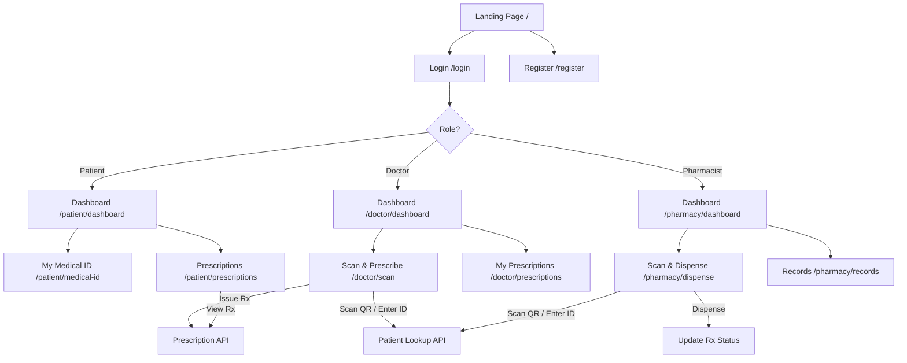

# AyuLink – Digital Healthcare Platform – Walkthrough

## What Was Built

A complete, production-ready Next.js 14+ web application that replaces paper prescriptions with a secure Digital Medical ID and digital prescription system. Includes full authentication, role-based dashboards (Patient, Doctor, Pharmacist) with **9 fully functional pages**, QR-code Medical IDs, digital prescription builder, and pharmacy dispensing.

---

## Demo Account Credentials

| Role | NIC Number | Password | Name |
|------|-----------|----------|------|
| 👤 **Patient** | `200012345678` | `password123` | Sasindu Malhara |
| 🩺 **Doctor** | `199812345678` | `password123` | Dr. Amal Perera (Cardiology) |
| 💊 **Pharmacist** | `199512345678` | `password123` | Nimal Fernando |

> [!TIP]
> Run `npx prisma db seed` to reset demo data, or visit `http://localhost:3000/api/seed` in development.

---

## All Pages – Screenshots

### Patient Experience

````carousel

<!-- slide -->

<!-- slide -->

````

### Doctor Experience

````carousel

<!-- slide -->

<!-- slide -->

````

### Pharmacy Experience

````carousel

<!-- slide -->

<!-- slide -->

````

### Landing & Auth

````carousel

<!-- slide -->

<!-- slide -->

````

---

## Demo Flow Recording


---

## Architecture



---

## Complete File List

### New Pages (This Update)
| File | Purpose |
|------|---------|
| [medical-id/page.tsx](file:///Users/sasindumalhara/Workspace/AyuLink/src/app/patient/medical-id/page.tsx) | **[NEW]** QR code, personal info, 4-step usage guide, security notice |
| [prescriptions/page.tsx](file:///Users/sasindumalhara/Workspace/AyuLink/src/app/patient/prescriptions/page.tsx) | **[NEW]** Filterable prescription list (All/Active/Dispensed) with search |
| [scan/page.tsx](file:///Users/sasindumalhara/Workspace/AyuLink/src/app/doctor/scan/page.tsx) | **[NEW]** QR scanner + manual ID input + full prescription builder |
| [prescriptions/page.tsx](file:///Users/sasindumalhara/Workspace/AyuLink/src/app/doctor/prescriptions/page.tsx) | **[NEW]** Doctor's issued prescriptions with stats and filters |
| [dispense/page.tsx](file:///Users/sasindumalhara/Workspace/AyuLink/src/app/pharmacy/dispense/page.tsx) | **[NEW]** QR scan + prescription ID search + Mark as Dispensed |
| [records/page.tsx](file:///Users/sasindumalhara/Workspace/AyuLink/src/app/pharmacy/records/page.tsx) | **[NEW]** Dispensing history with 4 stats + filters + search |

### Enhanced Dashboards (This Update)
| File | Changes |
|------|---------|
| [doctor/dashboard/page.tsx](file:///Users/sasindumalhara/Workspace/AyuLink/src/app/doctor/dashboard/page.tsx) | Added stats overview + quick-action cards + recent prescriptions |
| [pharmacy/dashboard/page.tsx](file:///Users/sasindumalhara/Workspace/AyuLink/src/app/pharmacy/dashboard/page.tsx) | Added 4 stats + quick-action cards + recent activity |
| [Sidebar.tsx](file:///Users/sasindumalhara/Workspace/AyuLink/src/components/Sidebar.tsx) | Updated routes to distinct pages + fixed isActive highlighting |

### Previously Built Files
| File | Purpose |
|------|---------|
| [schema.prisma](file:///Users/sasindumalhara/Workspace/AyuLink/prisma/schema.prisma) | User, DoctorProfile, Prescription, PrescriptionItem models |
| [seed.ts](file:///Users/sasindumalhara/Workspace/AyuLink/prisma/seed.ts) | Demo accounts + sample prescriptions seed script |
| [auth.ts](file:///Users/sasindumalhara/Workspace/AyuLink/src/lib/auth.ts) | NextAuth config (Credentials, JWT, role-based) |
| [register/route.ts](file:///Users/sasindumalhara/Workspace/AyuLink/src/app/api/auth/register/route.ts) | User registration endpoint |
| [prescriptions/route.ts](file:///Users/sasindumalhara/Workspace/AyuLink/src/app/api/prescriptions/route.ts) | Rx list & create |
| [prescriptions/[id]/route.ts](file:///Users/sasindumalhara/Workspace/AyuLink/src/app/api/prescriptions/%5Bid%5D/route.ts) | Rx detail & dispense |
| [patients/[medicalId]/route.ts](file:///Users/sasindumalhara/Workspace/AyuLink/src/app/api/patients/%5BmedicalId%5D/route.ts) | Patient lookup by Medical ID |
| [seed/route.ts](file:///Users/sasindumalhara/Workspace/AyuLink/src/app/api/seed/route.ts) | Browser-triggered seeding (dev only) |
| [page.tsx](file:///Users/sasindumalhara/Workspace/AyuLink/src/app/page.tsx) | Landing page |
| [login/page.tsx](file:///Users/sasindumalhara/Workspace/AyuLink/src/app/login/page.tsx) | Login page |
| [register/page.tsx](file:///Users/sasindumalhara/Workspace/AyuLink/src/app/register/page.tsx) | Multi-step registration |
| [patient/dashboard/page.tsx](file:///Users/sasindumalhara/Workspace/AyuLink/src/app/patient/dashboard/page.tsx) | Patient dashboard |
| All shared components | QRCodeDisplay, QRScanner, Sidebar, PrescriptionCard, DashboardLayout, AuthProvider |

---

## Verification Results

- ✅ **Build**: `npm run build` — 19 routes (13 pages + 6 API), 0 TypeScript errors
- ✅ **All 9 dashboard pages** functional with real data from seeded database
- ✅ **Sidebar navigation** — All tabs navigate to distinct pages with correct active highlighting
- ✅ **Patient tabs**: Dashboard (stats + QR + timeline) → Medical ID (QR + info + guide) → Prescriptions (filters + search)
- ✅ **Doctor tabs**: Dashboard (stats + quick actions + recent) → Scan & Prescribe (QR + builder) → My Prescriptions (filters + stats)  
- ✅ **Pharmacy tabs**: Dashboard (4 stats + quick actions + recent) → Scan & Dispense (QR + detail + dispense) → Records (4 stats + filters)
- ✅ **Registration**: Enhanced multi-step form with Pharmacist-specific fields
- ✅ **Prescription flow**: Doctor issues → Patient views → Pharmacist dispenses (full end-to-end)
