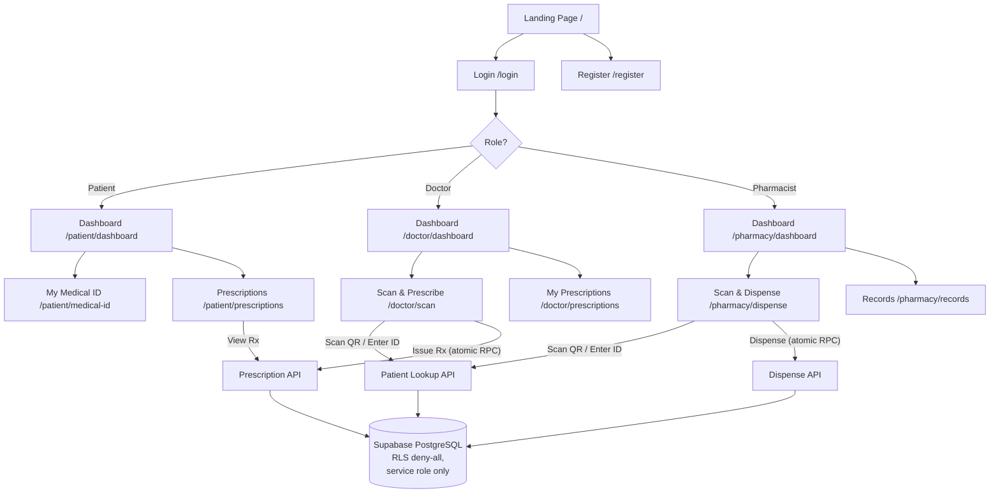

# AyuLink – Digital Healthcare Platform – Walkthrough

A guided tour of the application: what it does, how to try every role, and how the pieces fit together. For setup instructions see [docs/README.md](README.md); for the full feature inventory see [FULL_DOCUMENTATION.md](FULL_DOCUMENTATION.md).

---

## What AyuLink Is

A Next.js 15 web application that replaces paper prescriptions with a secure Digital Medical ID and digital prescription system, backed by **Supabase (PostgreSQL)**. It includes authentication with login throttling, provider verification, role-based dashboards (Patient, Doctor, Pharmacist) with **9 fully functional pages**, QR-code Medical IDs, a digital prescription builder, and per-item pharmacy dispensing with an atomic audit trail.

---

## Demo Account Credentials

| Role | NIC Number | Password | Name |
|------|-----------|----------|------|
| 👤 **Patient** | `200012345678` | `password123` | Sasindu Malhara |
| 🩺 **Doctor** | `199812345678` | `password123` | Dr. Amal Perera (Cardiology) |
| 💊 **Pharmacist** | `199512345678` | `password123` | Nimal Fernando |

> [!TIP]
> Seed demo data by running [`supabase/seed.sql`](../supabase/seed.sql) in the Supabase SQL Editor (no server needed), or by visiting `http://localhost:3000/api/seed` with the dev server running. Both are idempotent; all demo accounts are pre-verified. The pharmacist can also log in with license `PL-2024-001`.

---

## Screenshots

| | |
|---|---|
|  |  |
| Landing page | Patient dashboard |

---

## Guided Tour

### 1. Patient Experience

Log in with the patient NIC above.

1. **Dashboard** (`/patient/dashboard`) — greeting, three stat cards (Active / Total / Dispensed), a compact QR Medical ID preview with copy-to-clipboard, and a prescription timeline split into *Active* and *Past* sections.
2. **My Medical ID** (`/patient/medical-id`) — the full-size branded QR code, personal info, a 4-step "how to use" guide, and a security note (the QR only contains an identifier, never health data).
3. **My Prescriptions** (`/patient/prescriptions`) — filter tabs (All / Not Dispensed / Partial / Fully Dispensed) with live counts, plus search by diagnosis or doctor.

### 2. Doctor Experience

Log in with the doctor NIC.

1. **Dashboard** (`/doctor/dashboard`) — time-based greeting, stats, quick-action cards, and the five most recent prescriptions.
2. **Scan & Prescribe** (`/doctor/scan`) — scan a patient's QR with the camera, or type Medical ID `AYU-200012345678` and press *Look Up*. The patient card appears, then the prescription builder: diagnosis plus any number of medications (drug, dosage, frequency, duration, optional instructions). Submit with *Sign & Issue Digital Prescription*.
3. **My Prescriptions** (`/doctor/prescriptions`) — everything this doctor has issued, with stats, filters, and search by patient or diagnosis.

> Newly self-registered doctors are **unverified** and receive a "pending verification" error when issuing. Approve them by setting `verified = true` on their `User` row in the Supabase Table Editor.

### 3. Pharmacist Experience

Log in with the pharmacist NIC (pharmacists can also log in with their pharmacy license number).

1. **Dashboard** (`/pharmacy/dashboard`) — pharmacy identity card (name, license, address), stats, and quick actions.
2. **Scan & Dispense** (`/pharmacy/dispense`) — scan the patient QR or enter `AYU-200012345678`. Active prescriptions appear expanded, each with a dispensing progress bar. Dispense items one by one; each dispense is recorded with the pharmacist's identity and timestamp, and the prescription status recomputes automatically (Not → Partially → Fully Dispensed). An **Undo** button is available for 15 minutes after each dispense.
3. **Records** (`/pharmacy/records`) — history of everything this pharmacist has dispensed, with patient/diagnosis/ID search and stats (prescriptions, meds dispensed, patients served).

### 4. End-to-End Check

- Issue a new prescription as the doctor → log in as the patient and see it appear as *Active*.
- Dispense it as the pharmacist → the patient's view updates to *Fully Dispensed*, showing which pharmacy dispensed each item and when.

---

## Architecture

```mermaid
graph TD
    A["Landing Page /"] --> B["Login /login"]
    A --> C["Register /register"]
    B --> D{Role?}

    D -->|Patient| E["Dashboard /patient/dashboard"]
    E --> E1["My Medical ID /patient/medical-id"]
    E --> E2["Prescriptions /patient/prescriptions"]

    D -->|Doctor| F["Dashboard /doctor/dashboard"]
    F --> F1["Scan & Prescribe /doctor/scan"]
    F --> F2["My Prescriptions /doctor/prescriptions"]

    D -->|Pharmacist| G["Dashboard /pharmacy/dashboard"]
    G --> G1["Scan & Dispense /pharmacy/dispense"]
    G --> G2["Records /pharmacy/records"]

    F1 -->|"Scan QR / Enter ID"| H["Patient Lookup API"]
    F1 -->|"Issue Rx (atomic RPC)"| I["Prescription API"]
    G1 -->|"Scan QR / Enter ID"| H
    G1 -->|"Dispense (atomic RPC)"| J["Dispense API"]
    E2 -->|"View Rx"| I

    H --> K[("Supabase PostgreSQL<br/>RLS deny-all,<br/>service role only")]
    I --> K
    J --> K
```

All database access happens server-side in the API routes through a supabase-js client using the service role key. Multi-table writes (registration, prescription creation, dispensing) run as transactional Postgres functions called via `supabase.rpc()`.

---

## Key Files

### Backend

| File | Purpose |
|------|---------|
| [supabase/migrations/20260719000000_init.sql](../supabase/migrations/20260719000000_init.sql) | Full schema: 5 tables, 2 enums, triggers, 3 RPC functions, RLS |
| [src/lib/supabase.ts](../src/lib/supabase.ts) | Supabase server client singleton (service role) |
| [src/lib/auth.ts](../src/lib/auth.ts) | NextAuth config: dual login, throttling, JWT callbacks |
| [src/lib/validation.ts](../src/lib/validation.ts) | zod schemas for register / create / dispense |
| [src/lib/rate-limit.ts](../src/lib/rate-limit.ts) | In-memory rate limiter |
| [src/app/api/auth/register/route.ts](../src/app/api/auth/register/route.ts) | Registration (atomic, rate-limited, 409-mapped) |
| [src/app/api/patients/[medicalId]/route.ts](../src/app/api/patients/%5BmedicalId%5D/route.ts) | Patient lookup by Medical ID |
| [src/app/api/prescriptions/route.ts](../src/app/api/prescriptions/route.ts) | Role-filtered list + create (verified doctors) |
| [src/app/api/prescriptions/[id]/route.ts](../src/app/api/prescriptions/%5Bid%5D/route.ts) | Detail (ownership-checked) + dispense (atomic) |
| [src/app/api/pharmacy/profile/route.ts](../src/app/api/pharmacy/profile/route.ts) | Pharmacy profile |
| [src/app/api/seed/route.ts](../src/app/api/seed/route.ts) | Dev-only demo seeding |

### Frontend

| File | Purpose |
|------|---------|
| [src/app/page.tsx](../src/app/page.tsx) | Landing page |
| [src/app/login/page.tsx](../src/app/login/page.tsx) | Dual-mode login (NIC / pharmacy license) |
| [src/app/register/page.tsx](../src/app/register/page.tsx) | Multi-step registration wizard |
| `src/app/patient/*` | Dashboard, Medical ID, Prescriptions |
| `src/app/doctor/*` | Dashboard, Scan & Prescribe, Issued Prescriptions |
| `src/app/pharmacy/*` | Dashboard, Scan & Dispense, Records |
| `src/components/*` | QRCodeDisplay, QRScanner, Sidebar, PrescriptionCard, DashboardLayout, AuthProvider |

---

## Verification Results

- ✅ **Build**: `npm run build` — 19 routes (13 pages + 6 API), 0 TypeScript errors
- ✅ **All 9 dashboard pages** functional with real data from the seeded Supabase database
- ✅ **Prescription flow**: Doctor issues → Patient views → Pharmacist dispenses (full end-to-end)
- ✅ **Access control**: patients cannot read others' prescriptions; unverified providers blocked from issuing/dispensing
- ✅ **Atomicity**: registration, prescription creation, and dispensing run as single Postgres transactions
- ✅ **Throttling**: login and registration rate limits verified; credential failures return a single generic message
