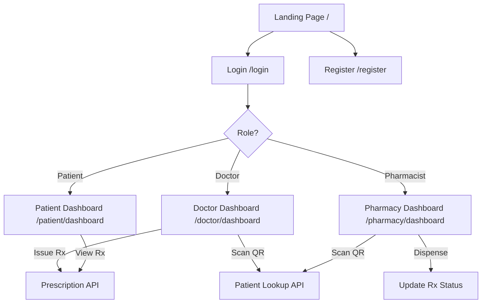

# AyuLink – Digital Healthcare Platform – Walkthrough

## What Was Built

A complete, production-ready Next.js 14+ web application that replaces paper prescriptions with a secure Digital Medical ID and digital prescription system.

---

## Screenshots

````carousel

<!-- slide -->

<!-- slide -->

````

---

## Architecture Overview



---

## Files Created

### Configuration
| File | Purpose |
|------|---------|
| [package.json](file:///Users/sasindumalhara/Workspace/AyuLink/package.json) | Dependencies & scripts |
| [tsconfig.json](file:///Users/sasindumalhara/Workspace/AyuLink/tsconfig.json) | TypeScript config |
| [next.config.ts](file:///Users/sasindumalhara/Workspace/AyuLink/next.config.ts) | Next.js config |
| [postcss.config.mjs](file:///Users/sasindumalhara/Workspace/AyuLink/postcss.config.mjs) | PostCSS + Tailwind v4 |
| [.env](file:///Users/sasindumalhara/Workspace/AyuLink/.env) | Environment variables template |

### Database (Prisma)
| File | Purpose |
|------|---------|
| [schema.prisma](file:///Users/sasindumalhara/Workspace/AyuLink/prisma/schema.prisma) | User, DoctorProfile, Prescription, PrescriptionItem models |

### Backend (API Routes)
| File | Purpose |
|------|---------|
| [auth.ts](file:///Users/sasindumalhara/Workspace/AyuLink/src/lib/auth.ts) | NextAuth config (Credentials, JWT, role-based) |
| [route.ts](file:///Users/sasindumalhara/Workspace/AyuLink/src/app/api/auth/%5B...nextauth%5D/route.ts) | NextAuth handler |
| [register/route.ts](file:///Users/sasindumalhara/Workspace/AyuLink/src/app/api/auth/register/route.ts) | User registration endpoint |
| [prescriptions/route.ts](file:///Users/sasindumalhara/Workspace/AyuLink/src/app/api/prescriptions/route.ts) | Rx list & create |
| [prescriptions/[id]/route.ts](file:///Users/sasindumalhara/Workspace/AyuLink/src/app/api/prescriptions/%5Bid%5D/route.ts) | Rx detail & status update |
| [patients/[medicalId]/route.ts](file:///Users/sasindumalhara/Workspace/AyuLink/src/app/api/patients/%5BmedicalId%5D/route.ts) | Patient lookup by Medical ID |

### Shared Components
| File | Purpose |
|------|---------|
| [QRCodeDisplay.tsx](file:///Users/sasindumalhara/Workspace/AyuLink/src/components/QRCodeDisplay.tsx) | QR code card with brand colors |
| [QRScanner.tsx](file:///Users/sasindumalhara/Workspace/AyuLink/src/components/QRScanner.tsx) | Camera-based QR scanner modal |
| [Sidebar.tsx](file:///Users/sasindumalhara/Workspace/AyuLink/src/components/Sidebar.tsx) | Role-based dashboard sidebar |
| [PrescriptionCard.tsx](file:///Users/sasindumalhara/Workspace/AyuLink/src/components/PrescriptionCard.tsx) | Expandable prescription card |
| [DashboardLayout.tsx](file:///Users/sasindumalhara/Workspace/AyuLink/src/components/DashboardLayout.tsx) | Auth-guarded layout wrapper |

### Pages
| File | Purpose |
|------|---------|
| [page.tsx](file:///Users/sasindumalhara/Workspace/AyuLink/src/app/page.tsx) | Landing page |
| [login/page.tsx](file:///Users/sasindumalhara/Workspace/AyuLink/src/app/login/page.tsx) | Split-screen login |
| [register/page.tsx](file:///Users/sasindumalhara/Workspace/AyuLink/src/app/register/page.tsx) | Multi-step registration |
| [patient/dashboard/page.tsx](file:///Users/sasindumalhara/Workspace/AyuLink/src/app/patient/dashboard/page.tsx) | Patient dashboard with QR + timeline |
| [doctor/dashboard/page.tsx](file:///Users/sasindumalhara/Workspace/AyuLink/src/app/doctor/dashboard/page.tsx) | Doctor prescription builder |
| [pharmacy/dashboard/page.tsx](file:///Users/sasindumalhara/Workspace/AyuLink/src/app/pharmacy/dashboard/page.tsx) | Pharmacy dispense dashboard |

---

## Verification Results

- ✅ **Build**: `npm run build` succeeded — 11 routes, 0 errors
- ✅ **Visual**: Landing, login, and register pages render correctly
- ✅ **Brand colors**: Deep Forest green, Vibrant Lime CTAs, Soft Shell background
- ✅ **Logo**: User's uploaded logos display correctly

## Next Steps (for the user)

1. **Set up PostgreSQL**: Update `DATABASE_URL` in [.env](file:///Users/sasindumalhara/Workspace/AyuLink/.env)
2. **Run migrations**: `npx prisma migrate dev --name init`
3. **Start dev server**: `npm run dev`
4. **Register a test account** and verify end-to-end flow
